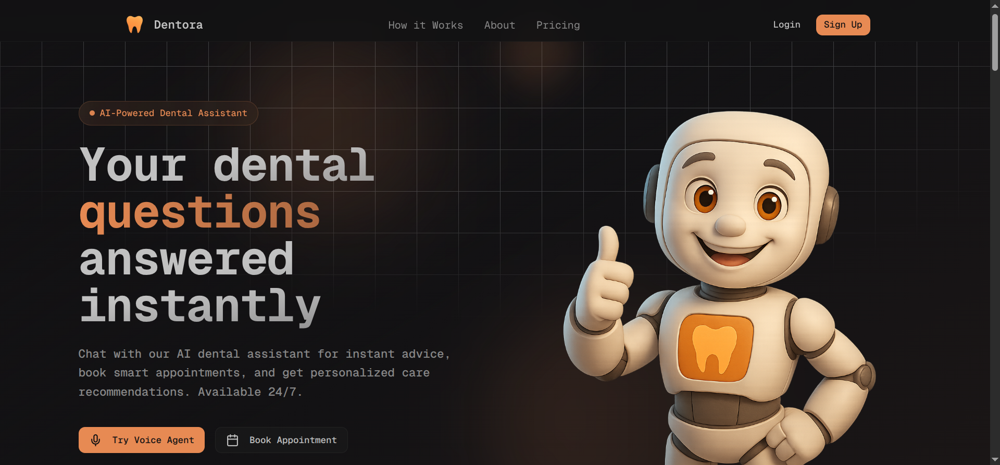

# Dentora

<p align="center">
  
</p>

<p align="center">
  
  
  
  
</p>

<p align="center">
  
  
  
  
</p>

<p align="center">
  
  
</p>

---

## Live Demo
Explore the project live here:  
🔗 https://dentora-one.vercel.app

---

## Overview

Dentora a modern full-stack web application built with a **high-performance, production-grade stack**.  
Focused on scalability, performance, clean architecture, and modern UI/UX.

---

## Tech Stack

### Frontend
- React  
- Next.js  
- TypeScript  
- TailwindCSS  

### Backend / Infrastructure
- Neon (PostgreSQL)  
- Prisma ORM  
- TanStack Query  
- Clerk (Authentication)  
- VAPI  
- Resend (Email)

---

## Getting Started

Install dependencies:
```bash
npm install
